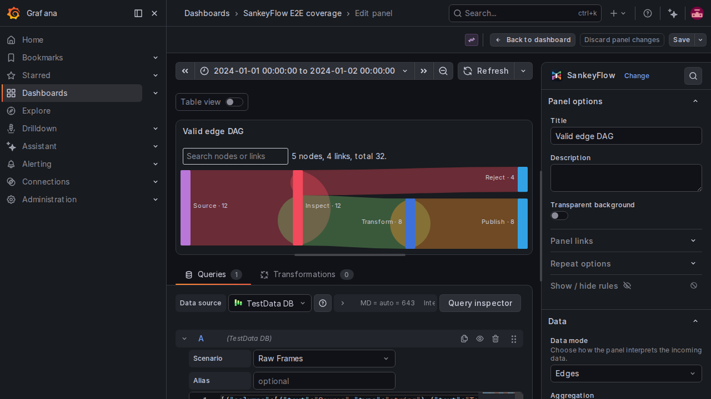

# SankeyFlow

[](https://github.com/aviadshiber/grafana-sankeyflow-panel/actions/workflows/ci.yml)
[](https://github.com/aviadshiber/grafana-sankeyflow-panel/actions/workflows/security.yml)
[](LICENSE)
[](https://grafana.com/)

SankeyFlow is a Grafana panel for exploring how measured volume moves through stages, systems, and states. It accepts ordinary Grafana data frames and renders interactive Sankey diagrams for direct edge data or multi-stage paths, including circular flows and time-based playback.



> **Project status:** SankeyFlow is in active alpha development. The public contract is documented in [`docs/data-model.md`](docs/data-model.md); behavior outside that contract may change before the first stable release.

## Highlights

- Edge and path input schemas that work with any Grafana data source.
- Circular links for feedback loops and return flows.
- Snapshot and playback modes for time-varying data.
- Search, selection, path highlighting, copyable details, and optional accessible tables.
- A compatibility tier for Grafana 11.5.2 and full support for Grafana 11.6.11 and later.

## Compatibility

| Grafana version   | Support tier                                                                                                              |
| ----------------- | ------------------------------------------------------------------------------------------------------------------------- |
| 11.5.2–11.6.10    | Compatibility tier: supported contract with focused validation; report version-specific issues with reproduction details. |
| 11.6.11 and later | Full support tier: primary development and verification target.                                                           |

SankeyFlow is a panel plugin, not a data source. Your Grafana instance must be able to query the data source that provides the fields described in the [data model](docs/data-model.md).

## Quick start

### Try it locally with Docker or Colima

Requirements: Node.js 22+, npm 11+, and Docker Compose 2.24.4+. On macOS, Docker Desktop or [Colima](https://github.com/abiosoft/colima) can provide the Docker runtime.

```bash
npm install
npm run server
```

Open the Grafana URL printed by Compose, create a dashboard, and add a SankeyFlow panel. To run against a specific Grafana version:

```bash
GRAFANA_VERSION=11.6.11 npm run server
```

For a local development loop, use `npm run dev` in one terminal and the repository’s Grafana container in another. See [local development](docs/development.md).

### Install in a self-managed Grafana

Use a signed catalog release for production after Grafana approves the plugin. Install the extracted plugin directory under Grafana’s plugin path and restart Grafana. Unsigned builds are intended only for the scaffolded development environment. See [deployment](docs/deployment.md) for Docker, self-managed, and Helm-oriented guidance.

## Data and configuration

Start with one of these shapes:

```text
source,target,value[,time][,nodeGroup][,linkGroup][,label]
```

or:

```text
stage_1,stage_2,...,stage_n,value[,time]
```

The panel maps fields explicitly where possible; `dataMode: auto` detects edge or path input. Values must be finite and non-negative. Complete field definitions, aggregation rules, circular-flow behavior, and playback semantics are in [Data model and panel contract](docs/data-model.md).

## Documentation

- [Data model and panel contract](docs/data-model.md)
- [Architecture](docs/architecture.md)
- [Deployment](docs/deployment.md)
- [Development and testing](docs/development.md)
- [Support](docs/support.md)
- [Roadmap](ROADMAP.md)

## Community and governance

SankeyFlow is community-oriented OSS. Contributions, issue reports, and documentation improvements are welcome. Read [CONTRIBUTING.md](CONTRIBUTING.md), [GOVERNANCE.md](GOVERNANCE.md), and the [Code of Conduct](CODE_OF_CONDUCT.md) before participating.

If you want SankeyFlow signed or listed in the Grafana community catalog, see [Community signing and catalog requests](docs/deployment.md#community-signing-and-catalog-requests). Catalog inclusion and signing are external review processes and are not implied by using this repository.

## Adapting this project

Forks are welcome, but a Grafana plugin's identity is a coordinated public contract. Before
publishing a fork:

1. Choose the owning Grafana Cloud organization and replace
   `aviadshiber-sankeyflow-panel` everywhere before the first catalog submission.
2. Update `package.json`, `src/plugin.json`, catalog README links, badges, screenshots, and the
   Playwright asset-prefix check to the new repository and plugin ID.
3. Update the bundled `.agents/skills/use-sankeyflow` references if the data contract changes.
4. Run unit tests, fixture validation, the provisioned Playwright suite, a production build, and
   Grafana's plugin validator before creating a release.

Do not rename an ID after Grafana has published it; use a new plugin ID for a separately owned
distribution.

## License

SankeyFlow is licensed under the [Apache License 2.0](LICENSE).
